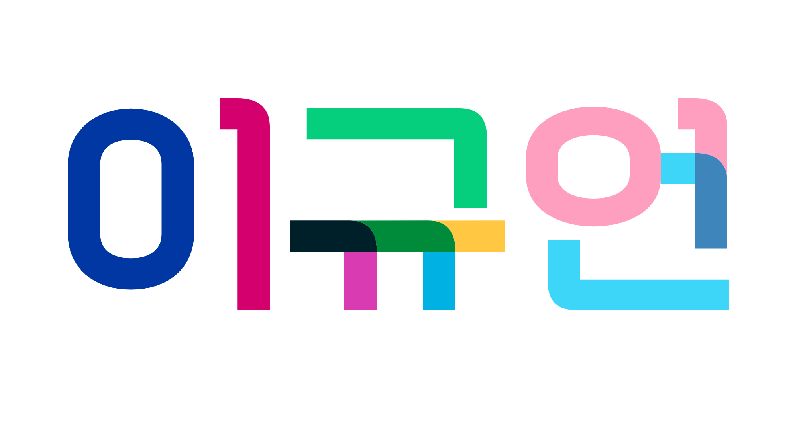

<!DOCTYPE html><html lang="en-US"> <head> <meta charset="UTF-8"> <meta http-equiv="X-UA-Compatible" content="IE=edge"> <meta name="viewport" content="width=device-width, initial-scale=1">

<h1 id="규어니의-자기소개️️-한국어en">규어니의 자기소개✨️✨️ [한국어/EN]</h1>
<h6 id="한국어">한국어</h6>
안녕하세영! 👋 저는 @6k2ldk, 이규언이에여. <a href="https://qrz.com/db/6k2ldk">6K2LDK</a>는 제 콜사인이에요.

제 대명사는 She/Her/They에요. 그리고 저는 트랜스여성 레즈비언으로 정체화하고 있어요! 저는 정말루 🏳️‍⚧️퀴어하답니다🏳️‍🌈저는 2012년 8월 30일에 태어났고, 경기도 남앙주시에 살고 있어요.

저는 아마추어 무선과 많은 사회적 소수자 인권 투쟁에 관심을 가지고 있어요.

저는 지금 아래의 단체에서 활동 중이에요! 🚩
<blockquote> 
<a href="https://jinboparty.com">경기청년진보당 청소년위원회</a>

<a href="https://crsnaeda.kr">청소년인권모임 내다</a>

<a href="https://yhrjieum.kr">청소년인권운동연대 지음</a>

<a href="https://asunaro.or.kr">청소년인권행동 아수나로</a>

<a href="https://lgbtpride.or.kr">행동하는성소수자인권연대</a>
</blockquote>

제 인스타 팔로우좀 해주세요😢😢 <a href="https://instagram.com/me6k2ldk">@me6k2ldk</a>어.. 더 할말이 없네여. 현장에서 만납시다! 투쟁! 88!

<h6 id="en">EN</h6>
Hi! 👋 I’m @6k2ldk, 이규언（Lee Gyueon, but just call me Dave). <a href="https://qrz.com/db/6k2ldk">6K2LDK</a> is my callsign.

My Pronouns are She/Her/They. ‘N I identify myself as trans women lesbian! I’m soo much 🏳️‍⚧️QUEEER🏳️‍🌈I was born in 30/08/2012 ‘N living at Gyeonggi-do, Korea.

I’m interested at HAM and mamy social minority rights.

I’m now a member of <a href="https://jinboparty.com">Jinbo Party</a>, <a href="https://amnesty.or.kr">Amnesty Korea</a>, <a href="https://crsnaeda.kr">Youth Rights Society NAEDA</a>.. and more! 🚩

my instagram is <a href="https&quot;//instagram.com/me6k2ldk">@me6k2ldk</a>! Please follow 😢😢and I.. dont have anything to say more. Meet you on the air! 88!`

  

 </body></html>
