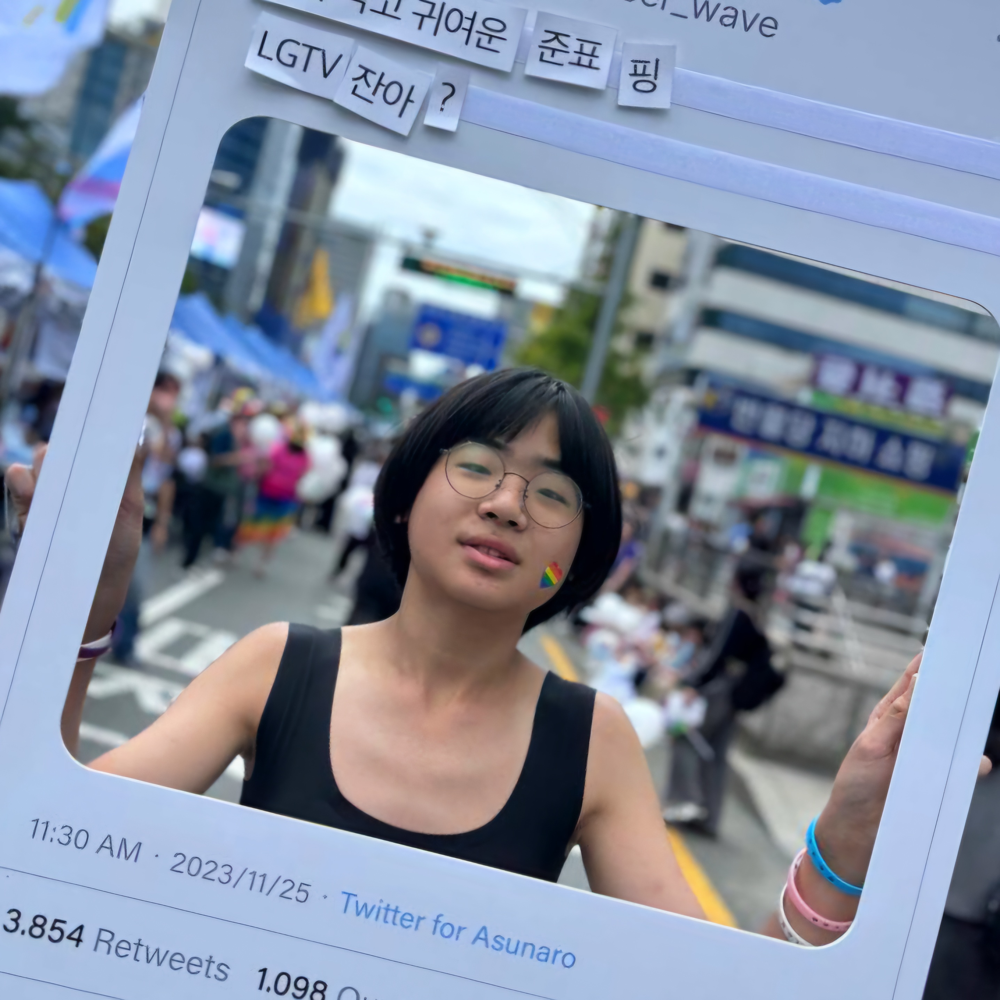
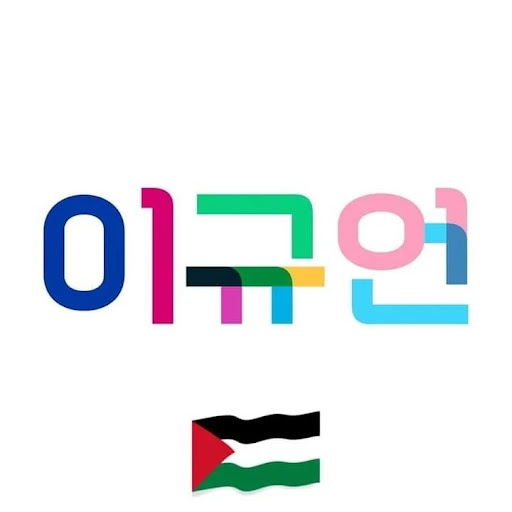

<!DOCTYPE html>
<html lang="en-US">
  <head>
    <meta charset="UTF-8">
    <meta http-equiv="X-UA-Compatible" content="IE=edge">
    <meta name="viewport" content="width=device-width, initial-scale=1">

<link rel="stylesheet" href="style.css">
<link rel="preconnect" href="https://fonts.googleapis.com">
<link rel="preconnect" href="https://fonts.gstatic.com" crossorigin>
<link href="https://fonts.googleapis.com/css2?family=Gothic+A1:wght@100;200;300;400;500;600;700;800;900&display=swap" rel="stylesheet"
<meta property="og:title" content="규어니의 자기소개✨️" />
<meta property="og:locale" content="en_US" />
<meta name="description" content="이것저것 하는 퀴어공주의 사이트" />
<meta property="og:description" content="이것저것 하는 퀴어공주의 사이트" />
<link rel="canonical" href="6k2ldk.github.io/" />
<meta property="og:url" content="6k2ldk.github.io/" />
<meta property="og:site_name" content="🏳️‍⚧️🏳️‍🌈🍉🎗🌹☔️✨️👩‍❤️‍👩" />
<meta property="og:type" content="website" />
<meta name="twitter:card" content="summary" />
<meta property="twitter:title" content="규어니의 자기소개✨️" />
</head>
  <body>
    

<h1><a href="6k2ldk.xyz/">🏳️‍⚧️🏳️‍🌈🍉🎗🌹☔️✨️👩‍❤️‍👩</a></h1>
<h1 id="규어니의-자기소개️">규어니의 자기소개✨️</h1>
<h3 id="한국어--engilsh--연락처contacts--혐오-아카이브"><a href="https://6k2ldk.github.io/6k2ldk/#%ED%95%9C%EA%B5%AD%EC%96%B4">한국어</a> / <a href="https://6k2ldk.github.io/6k2ldk/#en">Engilsh</a> / <a href="https://6k2ldk.github.io/6k2ldk/#%EC%97%B0%EB%9D%BD%EC%B2%98contacts">연락처(Contacts)</a> / <a href="https://archive.6k2ldk.xyz">혐오 아카이브</a></h3>

  
  
 

  

    
  

  

    <h3>이규언 / Gyueon Dave Lee</h3>
    <h4 style="font-weight:500">퀴어 트젠 레즈 쓰까페미 종북좌파 </h4>
    
생일 = 30. 08. 2012   지역 = 경기도 남양주시   직업 = (자칭) 활동가, 개발자

  

<h5 id="한국어">한국어</h5>

안녕하세영! 👋 저는 @6k2ldk, 이규언이에여. <a href="https://qrz.com/db/6k2ldk">6K2LDK</a>는 제 콜사인이에요.

제 대명사는 She/Her/They에요. 그리고 저는 트랜스여성 레즈비언으로 정체화하고 있어요! 저는 정말루 🏳️‍⚧️퀴어하답니다🏳️‍🌈 
저는 2012년 8월 30일에 태어났고, 경기도 남양주시에 살고 있어요.

혐오아카이브의 활동가로 활동하고 있어요!

저는 아마추어 무선과 많은 사회적 소수자 인권 투쟁에 관심을 가지고 있어요.

저는 지금 아래의 단체에서 활동 중이에요! 🚩

<blockquote>
  
<a href="https://jinboparty.com">경기청년진보당 청소년위원회</a>

  
<a href="https://crsnaeda.kr">청소년인권모임 내다</a>

  
<a href="https://yhrjieum.kr">청소년인권운동연대 지음</a>

  
<a href="https://asunaro.or.kr">청소년인권행동 아수나로</a>

  
<a href="https://lgbtpride.or.kr">행동하는성소수자인권연대</a>

  
<a href="https://amnesty.or.kr">국제엠네스티 한국지부</a>

</blockquote>

제 인스타 팔로우좀 해주세요😢😢 <a href="https://instagram.com/me6k2ldk">@me6k2ldk</a>
어.. 더 할말이 없네여. 현장에서 만납시다! 투쟁! 88!

<h5 id="en">EN</h5>

Hi! 👋 I’m @6k2ldk, 이규언（Lee Gyueon, but just call me Dave). <a href="https://qrz.com/db/6k2ldk">6K2LDK</a> is my callsign.

My Pronouns are She/Her/They. ‘N I identify myself as trans women lesbian! I’m soo much 🏳️‍⚧️QUEEER🏳️‍🌈 
I was born in 30/08/2012 ‘N living at Gyeonggi-do, Korea.

I’m interested at HAM and mamy social minority rights.

I’m now a member of <a href="https://jinboparty.com">Jinbo Party</a>, <a href="https://amnesty.or.kr">Amnesty Korea</a>, <a href="https://crsnaeda.kr">Youth Rights Society NAEDA</a>.. and more! 🚩

my instagram is <a href="https&quot;//instagram.com/me6k2ldk">@me6k2ldk</a>! Please follow 😢😢
and I.. dont have anything to say more. Meet you on the air! 88!`

<h5 id="연락처contacts">연락처/Contacts</h5>
<blockquote>
  
전화/Call: <a href="tel:+821082185635">+82-10-8218-5635</a> 
이메일/E-Mail: <a href="mailto:me@6k2ldk.xyz">me@6k2ldk.xyz</a>

</blockquote>

이외 연락처는 맨 상단 버튼 눌러서! 
Other contacts at the top button!

 
  

    
  

    <b>이규언 / Lee Gyueon(Dave)</b> Made with GitHub Pages Mobile: +82 10-8218-5635 E-Mail: me@6k2ldk.xyz
  

  </body>
</html>
